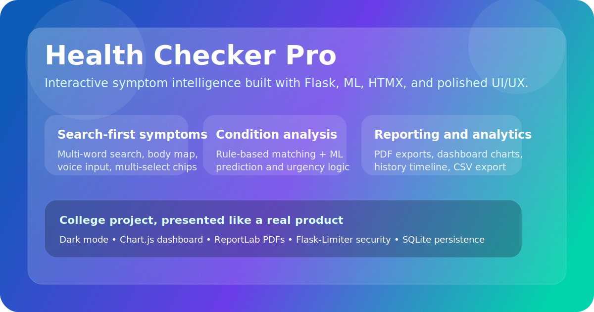
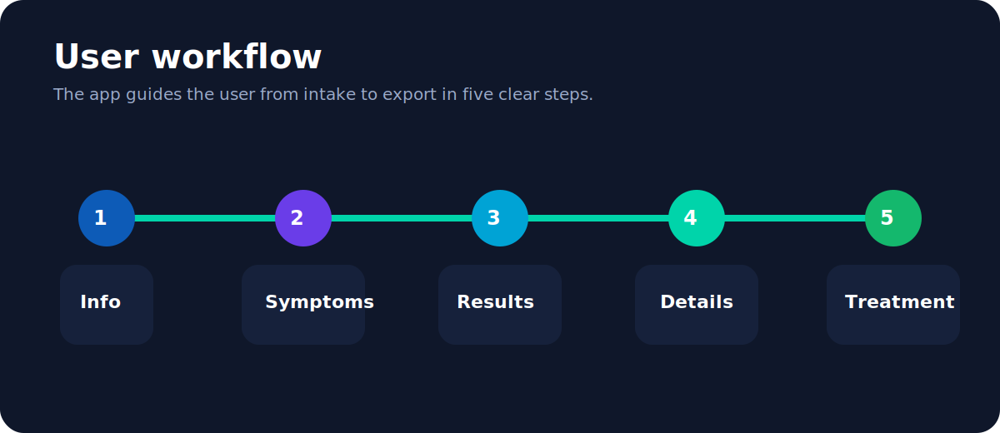
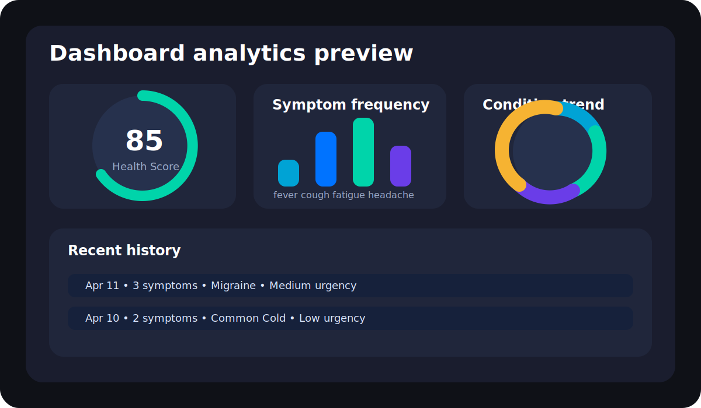

# Health Checker Pro

Health Checker Pro is a polished Flask-based symptom analysis web app built as a college project and upgraded into a more product-style experience. It combines a structured symptom workflow, rule-based condition matching, a lightweight ML prediction layer, interactive UI features, and downloadable health reports.

Live app: `https://health-checker-4sxc.onrender.com`



## Why this project stands out

- Modern multi-step experience: info -> symptoms -> conditions -> details -> treatment
- Search-first symptom picker with multi-word matching and multi-select chips
- Interactive body map and optional voice symptom input
- ML-assisted prediction combined with weighted symptom-condition logic
- PDF report export for each completed check
- Dashboard analytics with health score, streaks, and charts
- Profile timeline with CSV export
- Persistent dark mode and polished micro-interactions

## Visual walkthrough

### 1. Product overview


### 2. Analytics and reporting


## Core features

### Symptom intake
- Chat-style onboarding for age and gender
- Body-region symptom discovery
- HTMX-powered live search
- Multi-symptom selection without page reload
- Optional clinical detail inputs for better matching

### Analysis engine
- Weighted symptom-to-condition profile matching
- ML prediction integration from `predictor.py`
- Urgency scoring and emergency signal detection
- Confidence-ranked condition cards

### Reports and follow-up
- Downloadable PDF report with patient details, symptoms, top matches, and precautions
- Treatment and lifestyle guidance view
- Profile history timeline
- CSV export for all history

### Presentation layer
- Persistent dark mode
- Animated landing page
- Dashboard charts with Chart.js
- Confetti / warning result states
- Responsive Bootstrap 5 layout

## Tech stack

- Python 3
- Flask
- SQLite
- Jinja templates
- Vanilla JavaScript
- HTMX
- Bootstrap 5
- Chart.js
- AOS
- ReportLab
- Flask-Limiter
- Gunicorn

## Project structure

```text
HEALTH-CHECKER/
├── app.py
├── config.py
├── predictor.py
├── requirements.txt
├── Procfile
├── app/
│   ├── __init__.py
│   ├── models/
│   │   └── user_store.py
│   ├── routes/
│   │   └── main.py
│   └── services/
│       ├── __init__.py
│       └── prediction_service.py
├── model/
│   ├── dataset.csv
│   └── train_model.py
├── static/
│   ├── bodymap.js
│   ├── dashboard_charts.js
│   ├── script.js
│   └── styles.css
├── templates/
│   ├── base.html
│   ├── index.html
│   ├── info.html
│   ├── symptoms.html
│   ├── conditions.html
│   ├── details.html
│   ├── treatment.html
│   ├── dashboard.html
│   ├── profile.html
│   ├── login.html
│   ├── signup.html
│   ├── about.html
│   ├── contact.html
│   ├── _symptom_results.html
│   └── report_template.html
└── docs/
    └── images/
```

## How it works

1. User signs up or logs in.
2. User enters age and gender in the info step.
3. User searches and selects symptoms from the live picker.
4. The backend computes rule-based matches and blends in ML prediction.
5. The app stores the result in SQLite and shows ranked condition cards.
6. The user can review details, treatment guidance, download a PDF report, and track history later.

## Local setup

```bash
git clone https://github.com/myfault-rohan/HEALTH-CHECKER.git
cd HEALTH-CHECKER
python -m venv venv
```

Windows PowerShell:

```powershell
.\venv\Scripts\Activate.ps1
pip install -r requirements.txt
python app.py
```

Open:

```text
http://127.0.0.1:10000
```

## Environment variables

### Required in production
- `FLASK_ENV=production`
- `FLASK_SECRET_KEY=<strong-random-value>`

### Optional
- `DATABASE_PATH=<custom-sqlite-file>`
- `SESSION_COOKIE_SECURE=1`

## Deployment on Render

- Build command: `pip install -r requirements.txt`
- Start command: `gunicorn wsgi:app`

## Training the model

Only use the model training script in `model/train_model.py`.

```bash
python model/train_model.py
```

## Security and engineering notes

- Passwords are hashed with Werkzeug
- Login is rate-limited with Flask-Limiter
- Production secret key is enforced
- Full check results are stored in SQLite instead of oversized cookie sessions
- The PDF report route is authenticated per user

## Future improvements

- Add typo-tolerant search / fuzzy matching
- Add automated tests for routes and prediction service
- Add clinical explanation cards per result
- Add doctor-facing export formats
